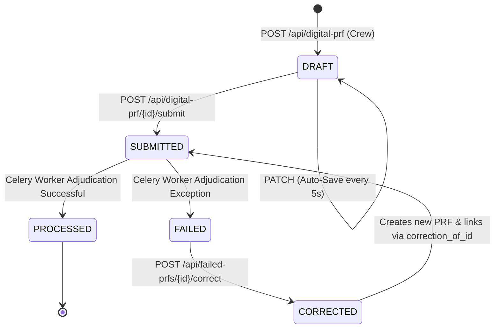

# EMS Digital Patient Report Form (PRF) Structure
*Single Source of Truth & Reference Specification to Prevent System Hallucination*

This document serves as the absolute technical specification for the **Digital Patient Report Form (PRF)** data model, database schema, frontend input components, and backend billing adapters. Refer to this specification when designing rules, processing claims, writing migrations, or querying data to ensure absolute structural consistency.

---

## 1. High-Level Data Flow & State Machine

Every digital PRF undergoes a sequential lifecycle, changing statuses as it progresses from crew data-entry to final medical claim adjudication:



### PRF Statuses (`PRFStatus` enum)
*   **`draft`**: The PRF is currently open in a crew member's mobile app. It can be modified, saved, or deleted by the creator.
*   **`submitted`**: The crew has tapped "Submit". The record is frozen (read-only for crew) and has been queued as a background Celery task for the billing pipeline.
*   **`processed`**: The Celery billing pipeline has successfully parsed the PRF, calculated the distance and times, checked HPCSA scopes, ran the adjudication engine, and created the corresponding `Case` and `Claim` records.
*   **`failed`**: The billing pipeline failed to process this PRF (e.g., due to unresolvable validation errors or database schema mismatches). It resides in the Admin review queue.
*   **`corrected`**: A previously failed PRF that has been manually corrected by a billing administrator. It remains as an audit record, pointing to the newly generated PRF via parent-child links.

---

## 2. Database Schema (`digital_prfs` Table)

The `DigitalPRF` model (SQLAlchemy) stores structural metadata in flat columns, while the fine-grained clinical fields (~120 fields) are stored inside the `form_data` JSON column to allow schema flexibility across different medical schemes.

### DB Table Columns Specification

| Column Name | SQL Type | Nullability | Description / Rules |
|:---|:---|:---|:---|
| **`id`** | `UUID` | **NOT NULL** (PK) | Primary Key. Defaults to `uuid.uuid4()`. |
| **`provider_id`** | `UUID` | **NOT NULL** (FK) | References `service_providers.id`. Identifies the owning ambulance company. |
| **`vehicle_id`** | `UUID` | *NULLABLE* (FK) | References `vehicles.id`. Identifies the dispatched ambulance. |
| **`crew_member_1_id`** | `UUID` | *NULLABLE* (FK) | References `crew_members.id`. The primary practitioner (creator/driver). |
| **`crew_member_2_id`** | `UUID` | *NULLABLE* (FK) | References `crew_members.id`. The secondary treating crew member. |
| **`prf_number`** | `INTEGER` | **NOT NULL** (Unique) | Auto-sequential PRF number generated via lock-free atomic PostgreSQL sequence. |
| **`case_number`** | `VARCHAR(50)` | *NULLABLE* (Unique) | Auto-generated human-readable reference, e.g., `JEMS-2026-05-001730` (`[provider_slug]-[YYYY]-[MM]-[prf_number]`). |
| **`status`** | `VARCHAR(20)` | **NOT NULL** | PRF lifecycle status. Maps to the `PRFStatus` enum. |
| **`form_data`** | `JSON` | *NULLABLE* (Default `{}`) | Primary clinical payload container. Holds the ~120 structured form values. |
| **`billing_schema_code`**| `VARCHAR(50)` | *NULLABLE* (Indexed) | Links this PRF to a `rate_schemas.schema_code` for price calculation. |
| **`submitted_at`** | `TIMESTAMPTZ` | *NULLABLE* | Timestamp when the crew submitted the PRF. |
| **`processing_error`** | `TEXT` | *NULLABLE* | Detailed error traceback written when Celery task processing fails. |
| **`processing_attempts`**| `INTEGER` | **NOT NULL** (Default `0`) | Number of Celery processing attempts (max retries = 3). |
| **`last_processing_at`** | `TIMESTAMPTZ` | *NULLABLE* | Timestamp of the most recent Celery billing worker processing attempt. |
| **`created_at`** | `TIMESTAMPTZ` | **NOT NULL** | Autogenerated record creation time in UTC. |
| **`updated_at`** | `TIMESTAMPTZ` | **NOT NULL** | Autogenerated record update time in UTC. |

### Real-Time Timestamps (DateTime with Timezone)
Captured instantly when the crew taps buttons in the mobile app. They are **never** typed manually:
*   `time_call_received`: The exact moment dispatch logs the call.
*   `time_dispatched`: Crew is dispatched / leaves the station.
*   `time_mobile`: Ambulance wheels roll / mobile en-route.
*   `time_on_scene`: Ambulance arrives at the incident scene location.
*   `time_depart_scene`: Ambulance leaves scene with patient.
*   `time_at_destination`: Ambulance arrives at the receiving hospital/facility.
*   `time_handover`: Handover signature is captured / patient transferred.
*   `time_available`: Ambulance is cleaned, restocked, and marked active for calls.
*   `time_back_to_base`: Ambulance returns to its home base/station.

### Odometer Readings (`Numeric(8, 1)`)
Entered manually by the crew. Handled as strings on the frontend (formatted with spaces on blur) and parsed securely on the backend.
*   `km_call_received`, `km_dispatched`, `km_mobile`, `km_on_scene`, `km_depart_scene`, `km_at_destination`, `km_handover`, `km_available`, `km_back_to_base`.

### Signature Containers (Text / Base64 PNGs)
*   `patient_signature`: Captures the patient's or guardian's consent.
*   `witness_signature`: Captured if patient signature is refused or impossible.
*   `handover_signature`: Signed by the receiving doctor/nurse at the facility.
*   `crew_signature`: Signed by the primary treating practitioner.

### Geo-Location Captures (`JSONB` Column: `geo_locations`)
Persists verified GPS coordinates captured at timestamp marks.
*   **Key**: Name of the timestamp field (e.g. `"time_on_scene"`).
*   **Schema**:
    ```json
    {
      "lat": -29.8587,
      "lng": 31.0218,
      "accuracy_m": 12.5,
      "captured_at": "2026-05-28T15:06:52.000Z",
      "spoofing_suspected": false
    }
    ```
> [!IMPORTANT]
> **GPS Spoofing Velocity Check**: When a GPS location is captured, the backend compares it to the most recently captured coordinate on the same PRF using the Haversine formula. If the implied speed between the two points exceeds **150 km/h**, `spoofing_suspected` is flagged as `true` in the metadata, and an audit warning is generated.

---

## 3. Nested `form_data` Key Schema (~120 Fields)

These fields reside as keys inside the JSON-serialized `form_data` attribute. To avoid system hallucinations, ensure you use the exact keys listed below:

### Phase 0: Dispatch
*   **`call_type`**: `PRIMARY` \| `IFT` (Inter-Facility Transfer) \| `IHT` (Inter-Hospital Transfer) \| `DOD` (Declaration of Death) \| `RHT` (Refused Hospital Transport) \| `COURTESY`
*   **`pre_planned_event`**: `boolean`
*   **`emed_reference_number`**: `string` (e.g. EMED authorization code)
*   **`preauth_number`**: `string` (e.g. 13-digit Netcare authorization code)
*   **`transfer_subtype`**: `string` (`Return Trip`, `Social Transfer`, `Upgrade Transfer`, `Downgrade Transfer`, `Hospital to Hospital`, `Hospital to Residence`, `Hospital to Stepdown`, `Residence to Hospital`, `Psychiatric`)
*   **`incident_classification`**: `MEDICAL` \| `TRAUMA`

### Phase 1: En Route
*   **`incident_location`**: `string` (Scene physical street address; Nominatim geocoded)
*   **`suburb_ward`**: `string` (Incident suburb/ward boundary)

### Phase 2: Patient Info / On Scene
*   **`patient_name`**: `string` (Patient first name)
*   **`patient_surname`**: `string` (Patient surname)
*   **`patient_id_number`**: `string` (SA ID Number, standard 13 digits, or passport number)
*   **`patient_dob`**: `string` (YYYY-MM-DD; auto-derived from SA ID YYMMDD prefix where possible)
*   **`age`**: `integer` (Auto-derived from DOB)
*   **`patient_weight_kg`**: `number` (Weight in kilograms; mandatory for medication dose validation)
*   **`billing_type`**: `Med Aid` \| `Private` \| `COID` \| `State` \| `Aggregator`
*   **`medical_scheme`**: `string` (BHF-standard medical aid name, e.g. "Discovery Health Medical Scheme")
*   **`medical_aid_number`**: `string` (Membership number)
*   **`dependent_number`**: `string` (e.g., `00` for main member, `01` for spouse)
*   **`priority`**: `Priority 1` \| `Priority 2` \| `Priority 3` \| `Priority 4`
*   **`patient_count`**: `integer` (Total patients treated at this incident)

### Phase 3: Clinical
*   **`chief_complaint`**: `string` (The presenting complaint reported by patient)
*   **`events_hpi`**: `string` (Narrative history of the present incident/injury)
*   **`findings_on_arrival`**: `string` (Practitioner diagnostic findings on scene)
*   **`management_notes`**: `string` (Details of medical interventions, medications, and transport details)
*   **`airway_interventions`**: `array of strings` (e.g., `["O2", "Nebulizer", "Intubation", "Ventilated", "Surg. Airway"]`)
*   **`circulation_interventions`**: `array of strings` (e.g., `["CPR", "Defibrillation", "Cardio Version", "Pacing"]`)
*   **`immob_equipment`**: `array of strings` (e.g., `["Collar", "Head Blocks", "Splint", "Scoop/Spine Board", "Spider Harness", "KED", "Vacuum Mattress"]`)
*   **`medications`**: `array of objects`
    *   *Schema*: `[{ "type": "Adrenaline", "dose": "1mg", "route": "IV", "time": "14:22" }]`
*   **`iv_therapy`**: `array of objects`
    *   *Schema*: `[{ "type": "Saline 0.9%", "site": "Left ACF", "vol_infused": "500ml" }]`
*   **`iv_purpose`**: `string` (e.g., `TKVO` for To Keep Vein Open)
*   **`mechanism`**: `string` (Primary trauma/medical mechanism category matching `MECHANISM_OPTS`)
*   **`mechanism_other`**: `string` (Trauma scenario details, e.g. "high speed passenger restrained")
*   **`icd10_primary`**: `string` (Primary billing diagnosis code in standard ICD-10 format, e.g., `I21.9`)
*   **`icd10_external_cause`**: `string` (External cause ICD-10 code for trauma cases, e.g., `W55.4`)
*   **`vitals_sets`**: `array of objects`
    *   *Schema*: `[{ "time": "14:15", "hr": 82, "bp": "120/80", "spo2": 98, "resp_rate": 16, "pain": "2", "gcs_e": "4", "gcs_v": "5", "gcs_m": "6", "hgt": 5.4, "temp": "36.5", ... }]`
*   **`ventilator_in_use`**: `boolean`
*   **`ventilator_settings_recorded`**: `boolean`
*   **`blood_gas_attached`**: `boolean`
*   **`has_ecg_attached`**: `boolean`
*   **`rosc_achieved`**: `boolean` (Return of Spontaneous Circulation)
*   **`perfusing_rhythm_on_handover`**: `boolean`
*   **`cardiac_incident`**: `boolean`
*   **`resuscitation_attempted`**: `boolean`
*   **`monitoring_level`**: `BLS` \| `ILS` \| `ALS` \| `ICU`
*   **`assessment_level`**: `BLS` \| `ILS` \| `ALS` \| `ICU`
*   **`supervising_practitioner_pr`**: `string` (HPCSA registration number of supervising practitioner, mandatory if crew is BAA-only)
*   **`supervising_practitioner_name`**: `string`
*   **`supervising_practitioner_qualification`**: `BAA` \| `AEA` \| `ECT` \| `ANT` \| `PARAMEDIC`

### Phase 4: Transport
*   **`closest_facility_bypassed`**: `boolean`
*   **`direct_admission`**: `boolean`
*   **`emed_notified`**: `boolean`
*   **`lifesaving_intervention_required`**: `boolean`

### Phase 5: Handover
*   **`receiving_facility`**: `string` (Hospital or clinic full name and physical address)
*   **`handover_name`**: `string` (Doctor or nurse full name accepting the patient)
*   **`handover_qualification`**: `string` (Qualification of practitioner, e.g. `MBChB`, `RN`)
*   **`receiving_facility_email`**: `string` (Target address for instant PDF export delivery on submit)

### Phase 6: Complete
*   **`signature_refused_reason`**: `string` (Documented reason if patient signature is unavailable)
*   **`call_out_fee_claimed`**: `boolean`
*   **`call_out_fee_dispatched_by_emed`**: `boolean`
*   **`vehicle_tracking_report`**: `boolean`
*   **`tracking_error_letter`**: `boolean`
*   **`is_multi_patient`**: `boolean`
*   **`patient_index_of_total`**: `string` (Format `"X of Y"`, e.g. `"1 of 3"`)

---

## 4. The Billing pipeline Adapter (`_adapt_prf_to_extracted_data`)

The down-stream tariff engine and mileage calculations were designed for paper PRFs processed via AI OCR extraction, which outputs a flat dictionary of keys (`extracted_data`). 

To bridge this gap, the FastAPI server normalizes the `DigitalPRF` model columns and nested `form_data` JSON keys into the canonical format before driving the calculations:

### Mappings & Normalization Matrix

| Canonical Adapter Key | Target Data Source | Format / Normalization Rule |
|:---|:---|:---|
| **`call_type`** | `form_data.call_type` | Stripped and capitalized. |
| **`dispatch_type`** | `form_data.call_type` | Inter-Facility transfers (`TRANSFER`, `IHT`, `RHT`, `COURTESY`) are normalized to `"IFT"`. Others become `"Primary"`. |
| **`medical_scheme`** | `form_data.medical_scheme` | BHF Standard medical aid string. |
| **`member_number`** | `form_data.medical_aid_number` | Alphanumeric membership ID. |
| **`patient_name`** | `form_data.patient_name` + `patient_surname` | Combined into `"First Surname"` string. |
| **`level_of_care`** | `form_data.monitoring_level` \| `assessment_level` \| `crew1.qualification` | Normalizes HPCSA registration codes (`BAA` → `BLS`, `AEA` → `ILS`, `ECT`/`ANT`/`PARAMEDIC` → `ALS`). |
| **`clinical_notes`** | `events_hpi` + `management_notes` + `findings_on_arrival` | Concat string for AI procedure-detection engine. |
| **`primary_survey`** | `survey_a` + `survey_b` + `survey_c` | Concat string: `"A: [airway]; B: [breathing]; C: [circ]"`. |
| **`procedures_performed`** | Concatenated arrays | Concat string of `airway_interventions` + `circulation_interventions` + `immob_equipment` + `iv_therapy`. |
| **`medications_administered`**| `form_data.medications` | Narrative format: `"Adrenaline 1mg IV 14:22"`. |
| **`odometer_dispatch`** | `DigitalPRF.km_dispatched` | Converted to `float()` or `None`. |
| **`odometer_at_scene`** | `DigitalPRF.km_on_scene` | Converted to `float()` or `None`. |
| **`odometer_departure`** | `DigitalPRF.km_depart_scene` | Converted to `float()` or `None`. |
| **`odometer_destination`** | `DigitalPRF.km_at_destination` | Converted to `float()` or `None`. |
| **`odometer_rtb`** | `DigitalPRF.km_back_to_base` | Converted to `float()` or `None`. |
| **`on_scene_time`** | `DigitalPRF.time_on_scene` | Formatted to `"HH:MM"`. |
| **`departure_from_scene_time`**| `DigitalPRF.time_depart_scene` | Formatted to `"HH:MM"`. |
| **`no_transport_call`** | `form_data.call_type` | `true` if `call_type` in `("DOD", "RHT")`. |
| **`declaration_of_death`** | `form_data.call_type` | `true` if `call_type` == `"DOD"`. |
| **`refused_transport`** | `form_data.call_type` | `true` if `call_type` == `"RHT"`. |

---

## 5. Critical Validation & Gating Rules

These hardcoded clinical rules guard the billing outcomes. Any mismatch forces a downgrade or rejection of the claim:

### 1. IFT Pre-Authorisation Gating (`NTC-3.2-IFT-PREAUTH`)
*   **Rule**: If `call_type` is `IFT` or `IHT`, the `preauth_number` field must contain exactly **13 digits** (non-digit characters are stripped before validation). Failing this, medical aid claims are immediately rejected.

### 2. South African ID Validation (`NTC-3.7-PATIENT-ID`)
*   **Rule**: `patient_id_number` must be a valid **13-digit SA ID** (matching the Luhn algorithm and date format) or a **6-15 character alphanumeric passport number**. 
*   *DOB Extraction*: The first 6 digits of the SA ID (`YYMMDD`) are parsed to generate the `patient_dob` automatically. Disambiguation: if `2000 + YY` is greater than the current calendar year, `1900 + YY` is chosen.

### 3. Vital Sign Counts (`NTC-3.7-MIN-3-VITALS`)
*   **Rule**: Every PRF requires **at least 3 sets of vital signs** captured at separate timestamps to substantiate billing above BLS. The vitals are pushed into the `vitals_sets` JSON array.
*   *Vitals Monitoring Cadence*: Cadence countdown before alert:
    *   **BLS**: 20 minutes
    *   **ILS**: 15 minutes
    *   **ALS / ICU**: 10 minutes

### 4. ILS IV-Therapy Downgrade Trap (`NTC-3.7-ILS-IV-JUSTIFICATION`)
*   **Rule**: Inserting an IV line at the ILS practitioner level is only billable under 4 medical situations. Unless one of these criteria is documented in the clinical narratives, the tariff engine will automatically downgrade the claim line to BLS:
    1.  *50% Dextrose* administered for hypoglycemia.
    2.  *Intravenous fluids* infused for hemodynamic compromise (e.g. hypovolemia).
    3.  *IV placed prior to ambulance arrival* (handover transport).
    4.  *Unstable patient* with documented deranged vitals.

### 5. Resuscitation Fee Gating (`NTC-3.5-RESUS-CRITERIA`)
*   **Rule**: Claiming the premium Resuscitation Tariff requires all 3 criteria to be met:
    1.  **ALS Practitioner** on scene (highest treating crew registered as ALS/ICU).
    2.  **Second ambulance / responder vehicle** present on scene (`second_vehicle_present` is true).
    3.  **ALS Interventions performed**: At least one procedure of Advanced Cardiac Life Support (ACLS drugs e.g., Adrenaline, Amiodarone, Atropine; or Endotracheal Intubation; Defibrillation; or External Pacing).

### 6. Empty vs. Zero Distances in Non-Transport Calls
> [!WARNING]
> **DOD / RHT Empty Odometer Handling**: For Declaration of Death (DOD) and Refused Hospital Transport (RHT) calls, there is **no patient transport leg**. The crew stays on scene and then returns to base. 
> *   `loaded_km` and `rtb_km` must be set to **`0.0`** explicitly by the adapter instead of falling back to default math. 
> *   `scene_minutes` is calculated between `time_on_scene` and `time_available` (since there is no `time_depart_scene`).
